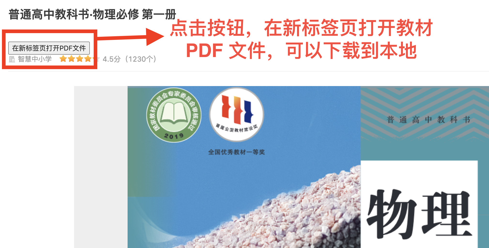

# 中小学教材 PDF 下载插件

本插件支持从教育部国家中小学智慧教育平台下载各版本的中小学教材 PDF

- https://www.zxx.edu.cn/tchMaterial
- https://basic.smartedu.cn/tchMaterial

## 未使用插件

只能在网页滚动页面阅读教材，无法下载

## 使用本插件

点击按钮，在新标签页打开教材 PDF 文件，可以下载到本地

## 安装方法

1. 从 [Zip 压缩包下载地址](https://github.com/changren-wcr/textbook-download-chrome-extension/archive/master.zip) 下载本仓库到本地
2. 解压缩到目录 `textbook-download-chrome-extension`
3. 打开 Chrome 浏览器插件页 <chrome://extensions>
4. 开启开发者模式
5. 点击加载已解压的扩展程序，找到并选择目录 `textbook-download-chrome-extension`
6. 不要删除目录 `textbook-download-chrome-extension`

 
